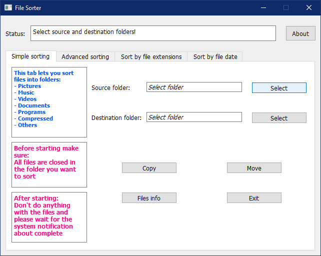

File Sorter
==============

This tool will help you to end the chaos of your unorganized files in a click.

Requires
-------------

 * Python 3.7 (Possibly others)
 
Python Modules
--------------
 
 * PyQt5 and PySide2 (pip install PyQt5 pyside2)
 * plyer (pip install plyer)

Description
--------------

You can move or copy your files by four methods:
 * Simple sorting: sort files into "Pictures", "Music", "Videos", "Documents", "Programs", "Compressed" and "Others" folders
 * Advanced sorting: sorts by category into separately selected folders
 * Sort by file extensions: sort files into directory according to their extensions
 * Sort by file date: sort files into directory according to their date [day-month-year] (on *nix the time of the last metadata change, on windows the creation time for path)

Usage
--------------

Select the tab with your sorting method.
Select the source and destination folders.
You can find out the number and size of files in the source folder by clicking "Files info".
To start sorting click "Copy" or "Move", according to your choice.
If the file from the source folder already exists in the destination folder, it will be copied with the copy number name.
On Windows must be turn On notifications from apps and other senders.

Important:
 * Before sorting  make sure all files are closed in the folder you want to sort
 * After start sorting don't do anything with the files, don't restart this tool and please wait for the system notification about complete

License
----------------
GNU GPL 3
